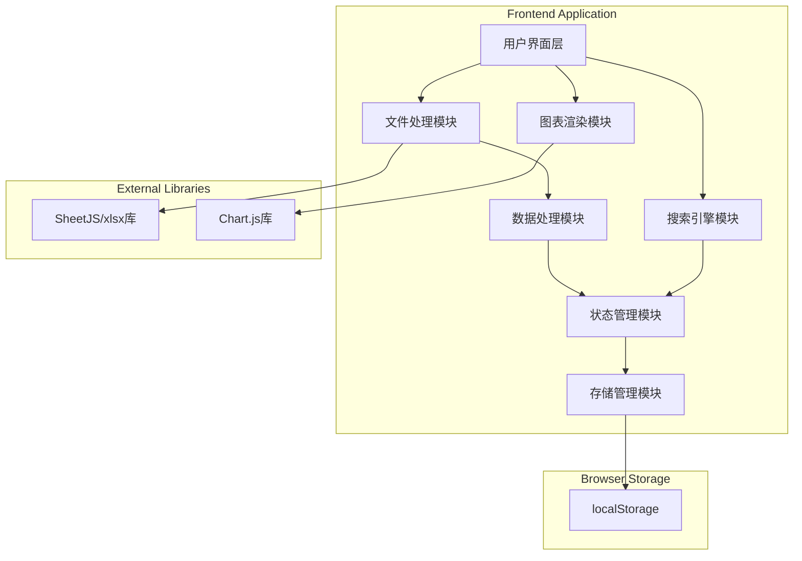

# Design Document

## Overview

销售数据对比系统是一个纯前端的单页面Web应用，使用HTML、CSS和JavaScript构建。系统允许用户导入多个月份的Excel销售数据，自动进行分组排序，以可视化方式展示数据对比，并提供交互式的趋势图表和搜索功能。系统支持数据本地存储和月份数据管理。

## Architecture



### 技术选型

- **前端框架**: 原生HTML/CSS/JavaScript（轻量级，无需构建工具）
- **Excel解析**: SheetJS (xlsx) - 成熟的Excel文件解析库
- **图表库**: Chart.js - 轻量级、易用的图表库，支持折线图
- **数据存储**: localStorage - 浏览器本地存储
- **样式**: CSS Grid/Flexbox 实现响应式布局

## Components and Interfaces

### 1. FileHandler（文件处理模块）

```typescript
interface FileHandler {
  parseExcelFile(file: File): Promise<ParseResult>;
}

interface ParseResult {
  columns: string[];
  data: Record<string, any>[];
  error?: string;
}
```

### 2. DataProcessor（数据处理模块）

```typescript
interface DataProcessor {
  filterColumns(data: Record<string, any>[], selectedColumns: string[]): Record<string, any>[];
  groupByCategory(data: Record<string, any>[], categoryColumn: string): GroupedData;
  sortBySalesAmount(groupedData: GroupedData, salesColumn: string): GroupedData;
  processData(data: Record<string, any>[], config: ProcessConfig): GroupedData;
}

interface GroupedData {
  [category: string]: Record<string, any>[];
}

interface ProcessConfig {
  selectedColumns: string[];
  categoryColumn: string;
  salesColumn: string;
  quantityColumn: string;
  productNameColumn: string;
}

interface ProcessedMonthData {
  id: string;
  month: string;
  color: string;
  importedAt: Date;
  config: ProcessConfig;
  groupedData: GroupedData;
  rawData: Record<string, any>[];
}
```

### 3. StateManager（状态管理模块）

```typescript
interface StateManager {
  addMonthData(monthData: ProcessedMonthData): void;
  removeMonthData(monthId: string): void;
  getAllMonthsData(): ProcessedMonthData[];
  getProductTrendData(productName: string): TrendDataPoint[];
  getNextColor(): string;
}

interface TrendDataPoint {
  month: string;
  salesAmount: number;
  quantity: number;
  category: string;
}
```

### 4. StorageManager（存储管理模块）

```typescript
interface StorageManager {
  saveData(data: ProcessedMonthData[]): void;
  loadData(): ProcessedMonthData[];
  clearData(): void;
}
```

### 5. ChartRenderer（图表渲染模块）

```typescript
interface ChartRenderer {
  renderTrendChart(canvas: HTMLElement, data: TrendDataPoint[], productName: string): void;
  destroyChart(): void;
}
```

### 6. SearchEngine（搜索引擎模块）

```typescript
interface SearchEngine {
  search(allData: ProcessedMonthData[], query: string): SearchResult[];
}

interface SearchResult {
  month: string;
  category: string;
  productName: string;
  quantity: number;
  salesAmount: number;
  data: Record<string, any>;
}
```

## Data Models

### MonthData（月份数据模型）

```typescript
interface MonthData {
  id: string;
  month: string;
  color: string;
  importedAt: Date;
  config: ProcessConfig;
  groupedData: GroupedData;
  rawData: Record<string, any>[];
}
```

### ProductRecord（商品记录模型）

```typescript
interface ProductRecord {
  productName: string;
  category: string;
  quantity: number;
  salesAmount: number;
  [key: string]: any;
}
```

### ColorPalette（颜色配置）

```typescript
const COLOR_PALETTE = [
  '#E3F2FD', '#FFF3E0', '#E8F5E9', '#FCE4EC',
  '#F3E5F5', '#E0F7FA', '#FFF8E1', '#EFEBE9',
];
```

## Correctness Properties

*A property is a characteristic or behavior that should hold true across all valid executions of a system.*

### Property 1: Column filtering preserves row count
*For any* valid dataset and any subset of selected columns, filtering columns SHALL preserve the original number of data rows.
**Validates: Requirements 1.2**

### Property 2: Category grouping completeness
*For any* valid dataset, after grouping by category, the sum of items across all category groups SHALL equal the total number of original items.
**Validates: Requirements 2.1**

### Property 3: Sales amount sorting correctness
*For any* category group, all items within the group SHALL be sorted in descending order by sales amount.
**Validates: Requirements 2.2**

### Property 4: Month color uniqueness
*For any* set of imported months, each month SHALL have a distinct background color.
**Validates: Requirements 3.3**

### Property 5: Product trend data consistency
*For any* product name search across multiple months, the returned trend data points SHALL only contain records where the product name exactly matches.
**Validates: Requirements 4.1**

### Property 6: Search result relevance
*For any* search query, all returned results SHALL contain the search term as a substring in at least one searchable field.
**Validates: Requirements 5.1, 5.3, 5.4**

### Property 7: Storage round-trip consistency
*For any* set of month data, saving to localStorage and then loading SHALL return equivalent data.
**Validates: Requirements 6.1, 6.2**

### Property 8: Delete operation completeness
*For any* month deletion, the deleted month SHALL no longer appear in state or storage.
**Validates: Requirements 7.1, 7.2**

## Error Handling

| 错误场景 | 处理方式 |
|---------|---------|
| 文件格式不支持 | 显示错误提示 |
| 文件为空 | 显示提示 |
| 未选择必要列 | 弹出提示框 |
| 商品仅存在于一个月份 | 显示提示 |
| localStorage不可用 | 降级为内存存储 |

## Testing Strategy

### 单元测试
使用Jest测试各模块功能。

### 属性测试（Property-Based Testing）
使用fast-check库进行属性测试，验证所有正确性属性。
