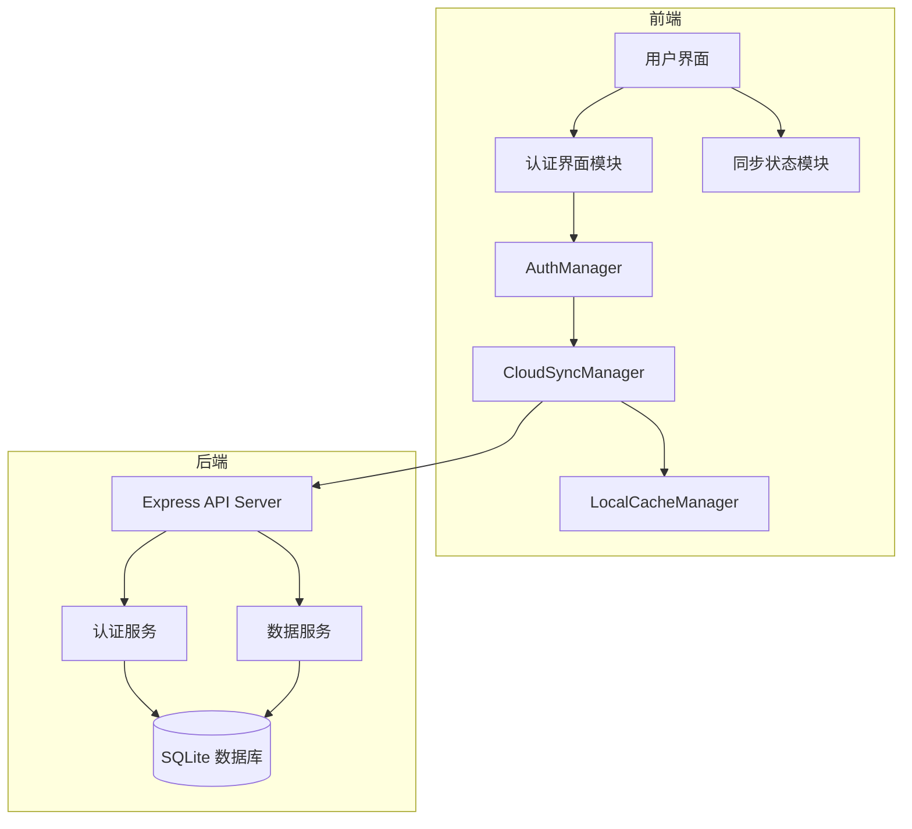

# 设计文档

## 概述

本设计为销售数据对比系统添加用户认证和云端数据存储功能。系统采用前后端分离架构，前端使用现有的纯 JavaScript 实现，后端使用 Node.js + Express 提供 RESTful API。数据存储使用 SQLite 数据库（便于部署和迁移）。为适应中国内陆用户，系统设计支持离线模式和本地缓存。

## 架构



### 技术选型

| 组件 | 技术 | 理由 |
|------|------|------|
| 前端 | 原生 JavaScript | 与现有代码保持一致 |
| 后端 | Node.js + Express | 轻量、易部署 |
| 数据库 | SQLite | 无需额外数据库服务，便于部署 |
| 密码加密 | bcrypt | 业界标准，安全可靠 |
| 会话管理 | JWT | 无状态，支持跨域 |

## 组件和接口

### 前端组件

#### 1. AuthManager 模块

负责用户认证状态管理和 API 调用。

```javascript
const AuthManager = {
    currentUser: null,
    token: null,
    
    // 注册新用户
    async register(username, password) -> { success: boolean, error?: string }
    
    // 用户登录
    async login(username, password) -> { success: boolean, error?: string }
    
    // 用户登出
    logout() -> void
    
    // 检查登录状态
    isLoggedIn() -> boolean
    
    // 获取当前用户
    getCurrentUser() -> { username: string } | null
    
    // 恢复会话（从 localStorage 读取 token）
    restoreSession() -> Promise<boolean>
    
    // 验证输入
    validateUsername(username) -> { valid: boolean, error?: string }
    validatePassword(password) -> { valid: boolean, error?: string }
}
```

#### 2. CloudSyncManager 模块

负责数据云端同步。

```javascript
const CloudSyncManager = {
    syncStatus: 'idle' | 'syncing' | 'error' | 'offline',
    
    // 上传销售数据
    async uploadData(monthData) -> { success: boolean, error?: string }
    
    // 删除云端数据
    async deleteData(monthId) -> { success: boolean, error?: string }
    
    // 下载所有用户数据
    async downloadAllData() -> { success: boolean, data?: array, error?: string }
    
    // 检查网络状态
    isOnline() -> boolean
    
    // 获取同步状态
    getSyncStatus() -> string
}
```

#### 3. LocalCacheManager 模块

负责本地缓存管理，支持离线模式。

```javascript
const LocalCacheManager = {
    // 缓存数据到本地
    cacheData(userId, data) -> void
    
    // 获取缓存数据
    getCachedData(userId) -> array
    
    // 记录待同步操作
    addPendingOperation(operation) -> void
    
    // 获取待同步操作
    getPendingOperations() -> array
    
    // 清除待同步操作
    clearPendingOperations() -> void
    
    // 清除用户缓存
    clearUserCache(userId) -> void
}
```

#### 4. AuthUI 模块

负责认证相关的 UI 渲染。

```javascript
const AuthUI = {
    // 显示登录表单
    showLoginForm() -> void
    
    // 显示注册表单
    showRegisterForm() -> void
    
    // 隐藏认证表单
    hideAuthForms() -> void
    
    // 更新头部用户状态显示
    updateHeaderUserStatus(user) -> void
    
    // 显示认证错误
    showAuthError(message) -> void
}
```

### 后端 API 接口

#### 认证接口

| 方法 | 路径 | 描述 | 请求体 | 响应 |
|------|------|------|--------|------|
| POST | /api/auth/register | 用户注册 | `{ username, password }` | `{ success, token?, error? }` |
| POST | /api/auth/login | 用户登录 | `{ username, password }` | `{ success, token?, user?, error? }` |
| POST | /api/auth/logout | 用户登出 | - | `{ success }` |
| GET | /api/auth/me | 获取当前用户 | - | `{ user }` |

#### 数据接口

| 方法 | 路径 | 描述 | 请求体 | 响应 |
|------|------|------|--------|------|
| GET | /api/data | 获取用户所有数据 | - | `{ success, data }` |
| POST | /api/data | 上传月度数据 | `{ monthData }` | `{ success, id?, error? }` |
| DELETE | /api/data/:id | 删除月度数据 | - | `{ success, error? }` |

### 请求头

所有需要认证的请求需携带：
```
Authorization: Bearer <token>
```

## 数据模型

### 用户表 (users)

| 字段 | 类型 | 约束 | 描述 |
|------|------|------|------|
| id | INTEGER | PRIMARY KEY | 用户ID |
| username | TEXT | UNIQUE, NOT NULL | 用户名 |
| password_hash | TEXT | NOT NULL | 密码哈希 |
| created_at | DATETIME | DEFAULT CURRENT_TIMESTAMP | 创建时间 |

### 销售数据表 (sales_data)

| 字段 | 类型 | 约束 | 描述 |
|------|------|------|------|
| id | INTEGER | PRIMARY KEY | 数据ID |
| user_id | INTEGER | FOREIGN KEY | 用户ID |
| month_id | TEXT | NOT NULL | 月份标识 |
| month_name | TEXT | NOT NULL | 月份名称 |
| color | TEXT | NOT NULL | 显示颜色 |
| config | TEXT | NOT NULL | 配置JSON |
| grouped_data | TEXT | NOT NULL | 分组数据JSON |
| raw_data | TEXT | NOT NULL | 原始数据JSON |
| created_at | DATETIME | DEFAULT CURRENT_TIMESTAMP | 创建时间 |
| updated_at | DATETIME | DEFAULT CURRENT_TIMESTAMP | 更新时间 |

### 前端数据结构

```javascript
// 用户会话数据
{
    token: string,          // JWT token
    user: {
        id: number,
        username: string
    }
}

// 同步状态
{
    status: 'idle' | 'syncing' | 'error' | 'offline',
    lastSyncTime: Date | null,
    pendingOperations: number
}
```


## 正确性属性

*属性是一种特征或行为，应该在系统的所有有效执行中保持为真——本质上是关于系统应该做什么的形式化陈述。属性是人类可读规范和机器可验证正确性保证之间的桥梁。*

### Property 1: 注册成功产生有效会话

*对于任意*有效的用户名（非空且不全为空白字符）和有效的密码（长度>=6），注册成功后系统应返回有效的 token，且用户处于登录状态。

**Validates: Requirements 1.1, 1.5**

### Property 2: 重复用户名注册被拒绝

*对于任意*已注册的用户名，使用相同用户名再次注册应返回"用户名已存在"错误，且不创建新用户。

**Validates: Requirements 1.2**

### Property 3: 短密码被拒绝

*对于任意*长度小于6的密码字符串，注册请求应返回密码长度错误，且不创建用户。

**Validates: Requirements 1.3**

### Property 4: 空白用户名被拒绝

*对于任意*空字符串或仅包含空白字符的用户名，注册请求应返回无效用户名错误。

**Validates: Requirements 1.4**

### Property 5: 正确凭证登录成功

*对于任意*已注册的用户，使用正确的用户名和密码登录应返回有效 token 并创建会话。

**Validates: Requirements 2.1**

### Property 6: 错误凭证登录失败

*对于任意*用户名和密码组合，如果用户名不存在或密码不匹配，登录应返回"用户名或密码错误"。

**Validates: Requirements 2.2**

### Property 7: 登录后数据加载

*对于任意*已登录用户，如果该用户在云端有销售数据，登录后应能获取到所有该用户的数据。

**Validates: Requirements 2.3, 4.4**

### Property 8: 登出清除会话和缓存

*对于任意*已登录用户，执行登出操作后，token 应被清除，本地缓存的用户数据应被清除，用户应处于未登录状态。

**Validates: Requirements 3.1, 3.2**

### Property 9: 数据上传同步

*对于任意*已登录用户上传的月度销售数据，上传成功后从云端查询应能获取到相同的数据。

**Validates: Requirements 4.1**

### Property 10: 数据删除同步

*对于任意*已登录用户删除的月度销售数据，删除成功后从云端查询应不再包含该数据。

**Validates: Requirements 4.2**

### Property 11: 云端数据优先

*对于任意*本地数据与云端数据不一致的情况，同步后本地数据应与云端数据一致。

**Validates: Requirements 4.5**

### Property 12: UI状态与登录状态一致

*对于任意*登录状态，UI 应正确反映：已登录时显示用户名和登出按钮，未登录时显示登录和注册按钮。

**Validates: Requirements 6.1, 6.2**

### Property 13: 密码哈希存储

*对于任意*注册的用户，数据库中存储的密码应是哈希值而非明文，且哈希值与原密码不相等。

**Validates: Requirements 7.1, 7.2**

### Property 14: Token 过期时间设置

*对于任意*生成的 Session_Token，解析后的过期时间应为7天后。

**Validates: Requirements 7.3**

## 错误处理

### 前端错误处理

| 错误场景 | 处理方式 |
|----------|----------|
| 网络请求失败 | 显示错误提示，保留本地数据，记录待同步操作 |
| Token 过期 | 清除本地 token，提示用户重新登录 |
| 服务器错误 (5xx) | 显示"服务暂时不可用"提示，启用离线模式 |
| 输入验证失败 | 在表单字段旁显示具体错误信息 |
| 数据同步冲突 | 以云端数据为准，覆盖本地数据 |

### 后端错误处理

| 错误场景 | HTTP 状态码 | 响应 |
|----------|-------------|------|
| 用户名已存在 | 409 | `{ success: false, error: "用户名已存在" }` |
| 凭证错误 | 401 | `{ success: false, error: "用户名或密码错误" }` |
| Token 无效/过期 | 401 | `{ success: false, error: "请重新登录" }` |
| 输入验证失败 | 400 | `{ success: false, error: "<具体错误>" }` |
| 服务器内部错误 | 500 | `{ success: false, error: "服务器错误" }` |

## 测试策略

### 单元测试

使用 Jest 作为测试框架。

**前端单元测试覆盖：**
- AuthManager 的输入验证函数
- LocalCacheManager 的缓存操作
- CloudSyncManager 的状态管理

**后端单元测试覆盖：**
- 密码哈希和验证函数
- JWT 生成和验证函数
- 输入验证中间件

### 属性测试

使用 fast-check 作为属性测试库。

**属性测试要求：**
- 每个属性测试运行至少 100 次迭代
- 每个属性测试必须用注释标注对应的设计文档属性
- 注释格式：`**Feature: user-auth-cloud-storage, Property {number}: {property_text}**`

**属性测试覆盖：**
- 用户名验证属性（Property 3, 4）
- 密码验证属性（Property 3）
- 注册/登录流程属性（Property 1, 2, 5, 6）
- 数据同步属性（Property 9, 10, 11）
- 安全性属性（Property 13, 14）

### 集成测试

**测试场景：**
- 完整的注册-登录-上传数据-登出-重新登录流程
- 离线模式下的数据操作和恢复同步
- 多设备数据同步场景

## 安全考虑

1. **密码安全**：使用 bcrypt 进行密码哈希，salt rounds 设置为 10
2. **JWT 安全**：使用 HS256 算法，密钥从环境变量读取
3. **HTTPS**：生产环境强制使用 HTTPS
4. **输入验证**：前后端双重验证，防止注入攻击
5. **速率限制**：登录接口限制每 IP 每分钟最多 10 次请求
